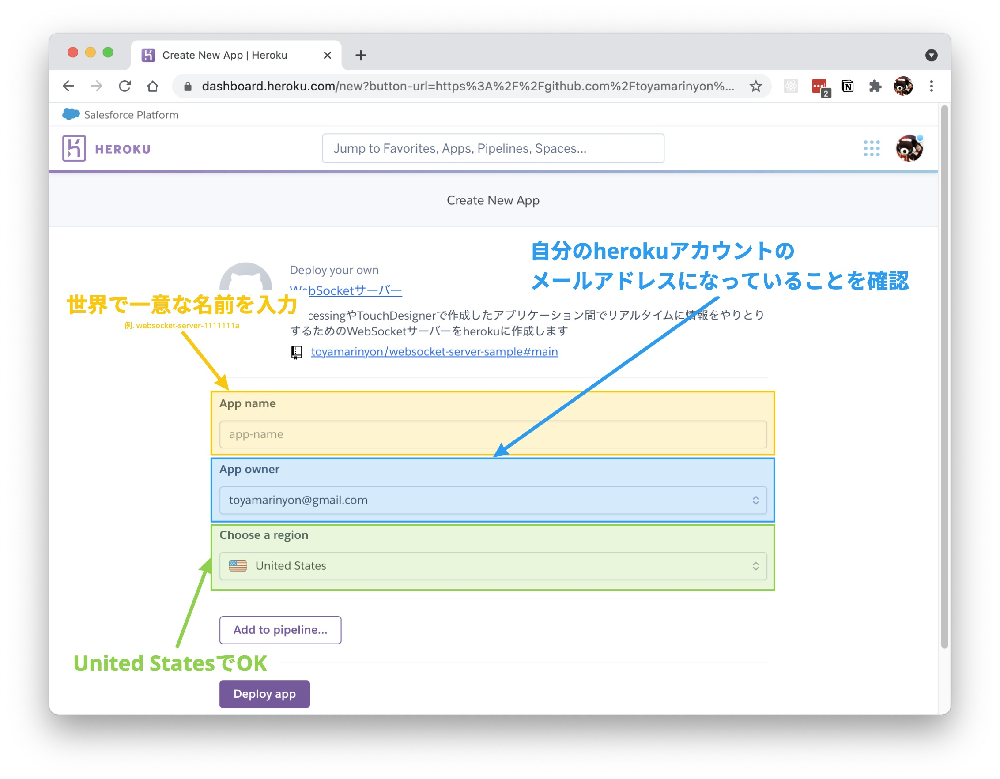
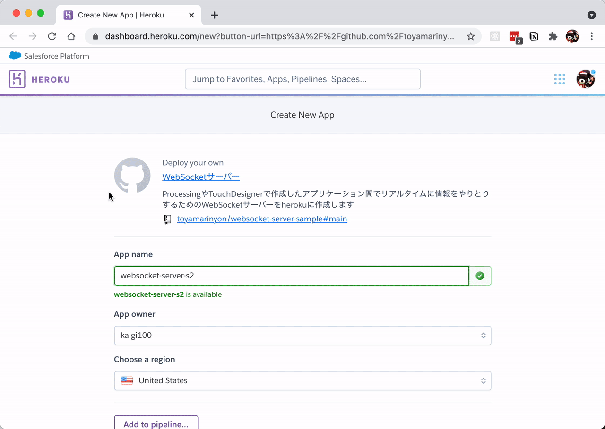

# A WebSocket server for visual art prototyping
ProcessingやTouchDesignerで作成したアプリケーション間でリアルタイムに情報をやりとりするためのWebSocketサーバーをherokuに作成する手順やコードをまとめています。
## 必要なもの
### heroku アカウント
herokuのアカウントを持っていない場合は、まずアカウントを作成してください
⇒ https://signup.heroku.com/jp
## 作成手順
1. まず以下のボタンを押してアプリ作成フォームを表示します

2. 以下の画像を参考にフォームの入力と確認をしてください

`App name`はあとで使うので、テキスト情報をどこかに残しておくと楽です

3. 入力できたら「Deploy app」ボタンを押します
アプリの作成までしばらく待ちます
以下のように画面が変わっていくと思いますので、完了するまでお待ちください。

