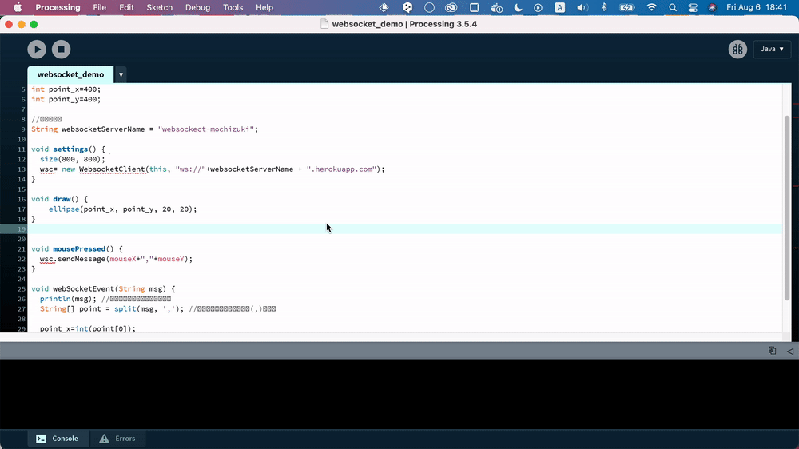

# A WebSocket server for visual art prototyping
ProcessingやTouchDesignerで作成したアプリケーション間でリアルタイムに情報をやりとりするためのWebSocketサーバーをherokuに作成する手順やコードをまとめています。
## 必要なもの
### heroku アカウント
herokuのアカウントを持っていない場合は、まずアカウントを作成してください
⇒ https://signup.heroku.com/jp
## 作成手順
1. まず以下のボタンを押してアプリ作成フォームを表示します

[](https://heroku.com/deploy)

2. 以下の画像を参考にフォームの入力と確認をしてください


`App name`はあとで使うので、テキスト情報をどこかに残しておくと楽です

3. 入力できたら「Deploy app」ボタンを押します
アプリの作成までしばらく待ちます
以下のように画面が変わっていくと思いますので、完了するまでお待ちください。


4. 「Your app was successfully deployed.」と表示されたら完了です。

## 動作確認
動作確認用のProcessingのsketchを使い、WebSocketで通信ができていることを確認します

### 事前準備 ProcessingにWebSocketライブラリを追加
1. Processingを起動します
2. ツールバーの`Sketch`->`Import Library`->`Add Library`をクリックします

3. `Contribution Manager`が表示されるので、検索フォームに`websocket`と入力して`Websockets|Create websocket servers and...`をクリックし右下の`↓ Install`ボタンをクリックします

4. `Status`に緑色のチェックがついたらインストール完了です


一連の流れは以下のようになると思います

### デモファイル使って動作確認

1. sketchをこちらからダウンロードしてください
⇒ https://github.com/mochizukiss/SyncLibrary/archive/refs/tags/v0.0.4.zip

2. zipを解凍して、`SyncLibrary-0.0.4/examples/processing/websocket_demo/websocket_demo.pde`をProcessingで開いてください


3. 12行目の`websocketServerName`にherokuのApp Nameを入力してください
```
String websocketServerName = "replace-it-with-your-heroku-app-name";
```


4. `websocket_demo.pde` を保存して別のマシンでも開いてPlayします。
別マシンではなく、`websocket_demo.pde`を別名で保存して、二つ立ち上げてPlayしてもOKです。

5. 画面をクリックすると両方のマシンでクリックした点が描画されます

こんな感じで、２つの端末で同じ位置に点が描画されます

